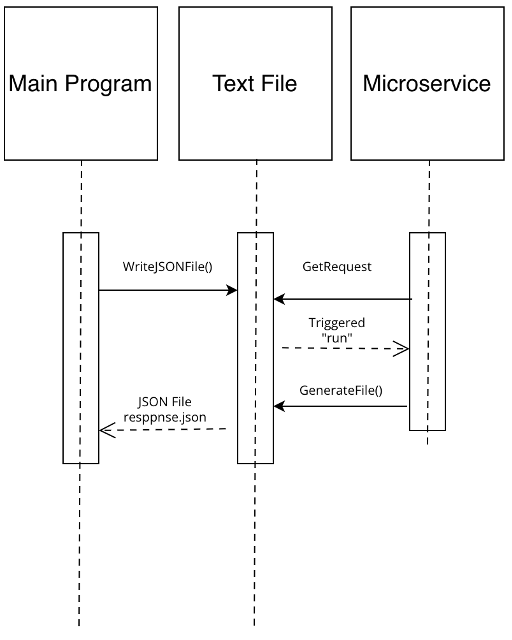

# MicroServiceTeam

This microservice get a request from a different program using text file and return a .json file for weather status.

## API Reference

#### You will need to create your own api_key from openweather website

## How to programmatically REQUEST data: 

You can request this microservice to run by writing the word “run” into a “request.txt” file. 

## How to programmatically RECEIVE data: 
The program then will call a function to make an API request and write the results in a “response.json” file.

#.JSON file example:

{
    "coord": {
        "lon": -122.6762,
        "lat": 45.5234
    },
    "weather": [
        {
            "id": 501,
            "main": "Rain",
            "description": "moderate rain",
            "icon": "10n"
        }
    ],
    "base": "stations",
    "main": {
        "temp": 280.32,
        "feels_like": 276.93,
        "temp_min": 278.81,
        "temp_max": 282.48,
        "pressure": 1004,
        "humidity": 87
    },
    "visibility": 10000,
    "wind": {
        "speed": 5.66,
        "deg": 130
    },
    "rain": {
        "1h": 1.59
    },
    "clouds": {
        "all": 100
    },
    "dt": 1700359163,
    "sys": {
        "type": 2,
        "id": 2008548,
        "country": "US",
        "sunrise": 1700320433,
        "sunset": 1700354287
    },
    "timezone": -28800,
    "id": 5746545,
    "name": "Portland",
    "cod": 200
}

## UML sequence diagram

